# RoomZy
 Phần mềm đặt phòng khách sạn và Resort Java Android
 # 🏆 Image Application 
<a href="./Image/ChiTietPhong.png">
>    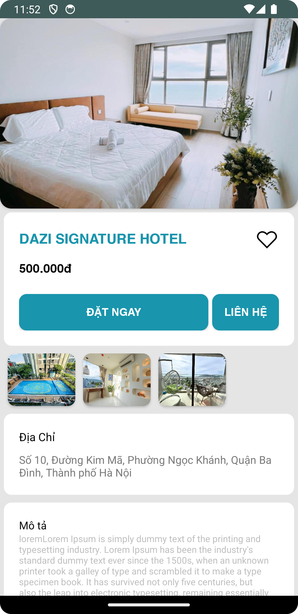
> </a>
<a href="./Image/ChiTietPhong_KeoTha.png">
>    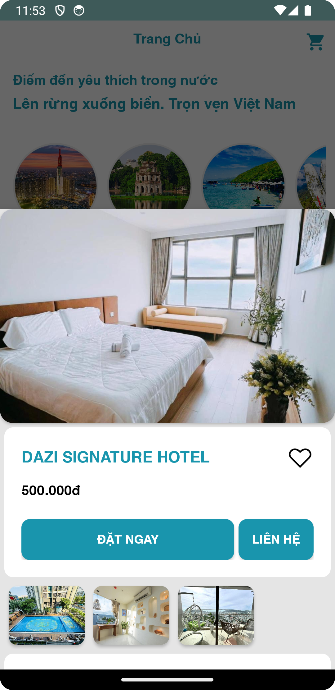
</a>
<a href="./Image/DangKi.png">
>    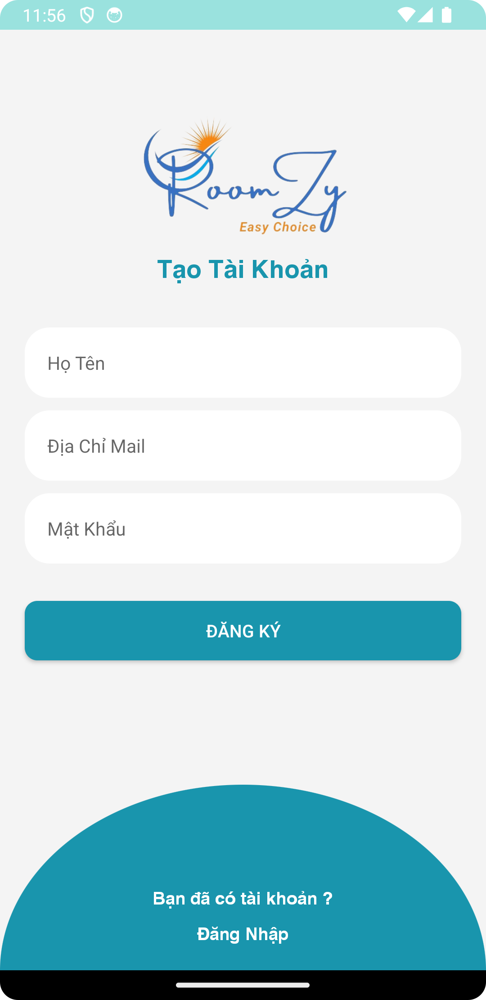
</a>
<a href="./Image/DangNhap.png">
>    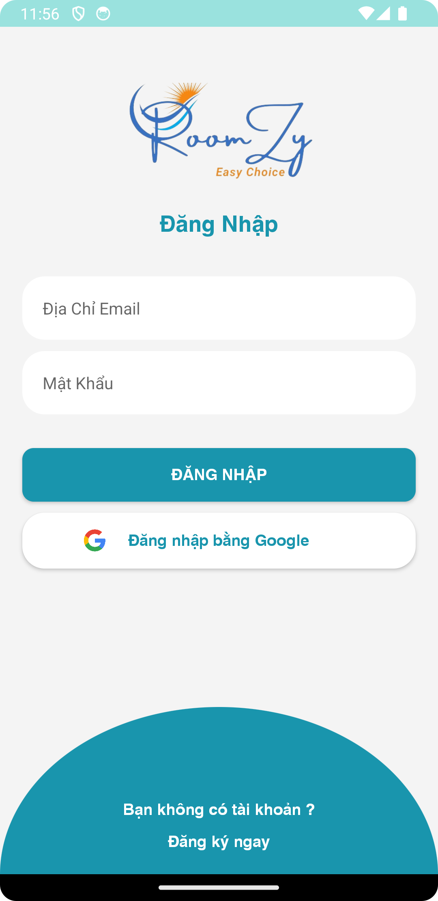
</a>
<a href="./Image/DanhSachTatCa.png">
>    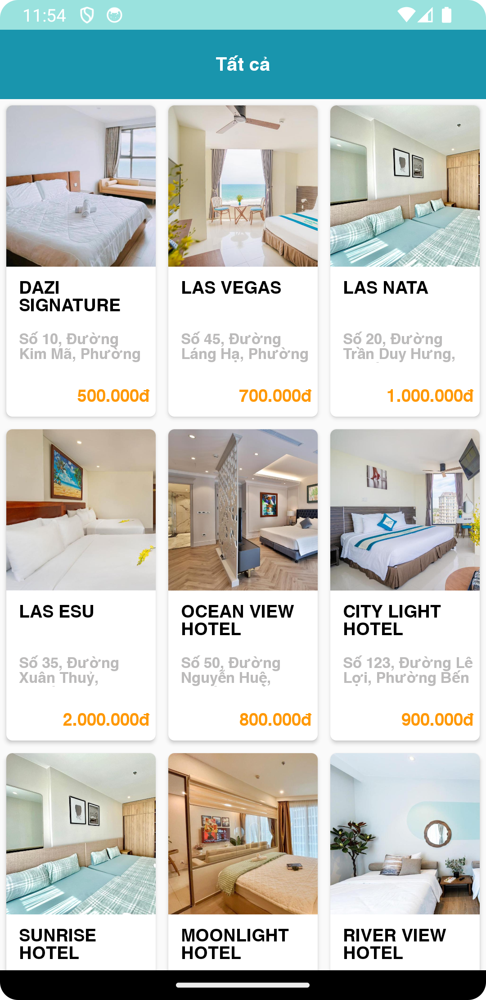
> </a>
<a href="./Image/DatPhong.png">
>    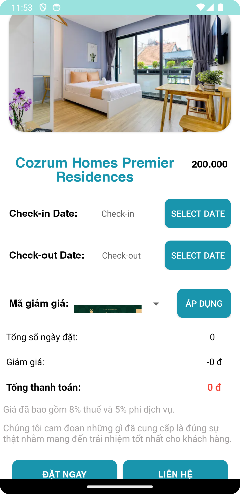
> </a>
<a href="./Image/DeXuat.png">
>    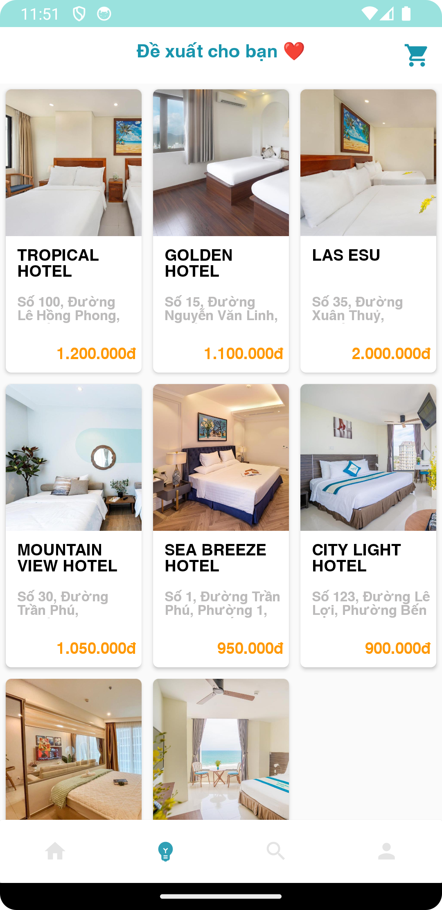
> </a>
<a href="./Image/DSPhongDaXem.png">
>    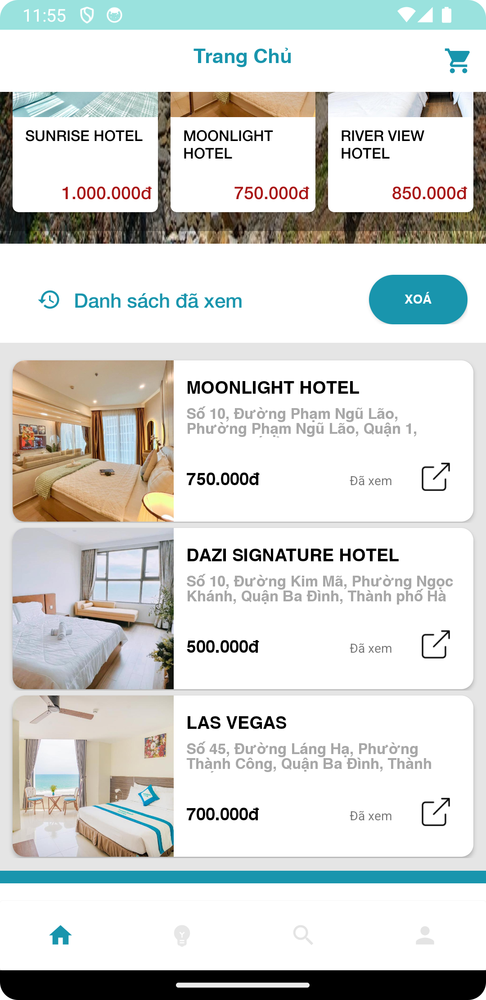
> </a>
<a href="./Image/GioHang.png">
>    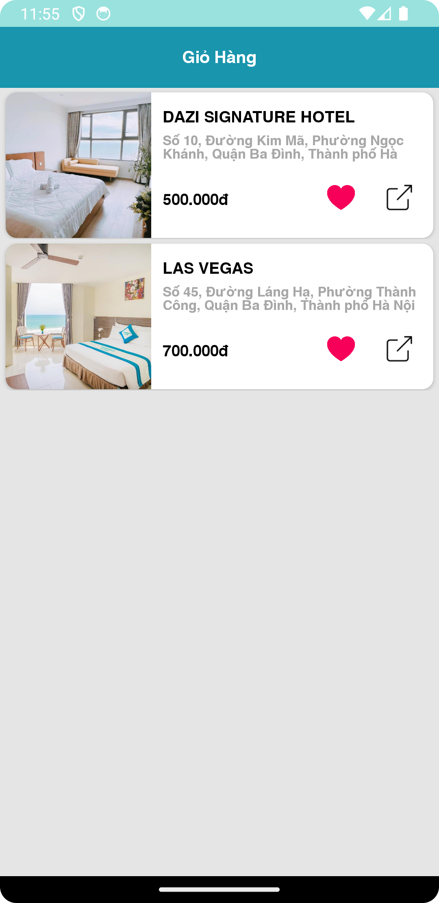
> </a>
<a href="./Image/Home1.png">
>    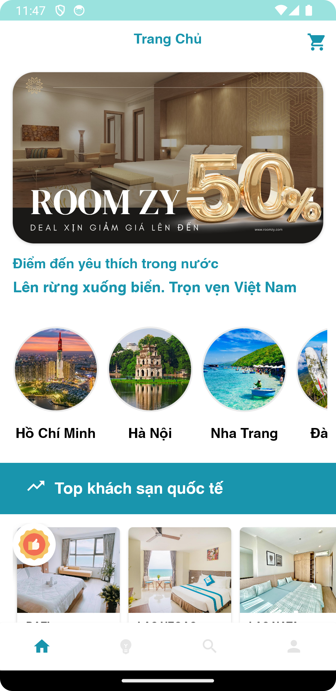
> </a>
<a href="./Image/Home2.png">
>    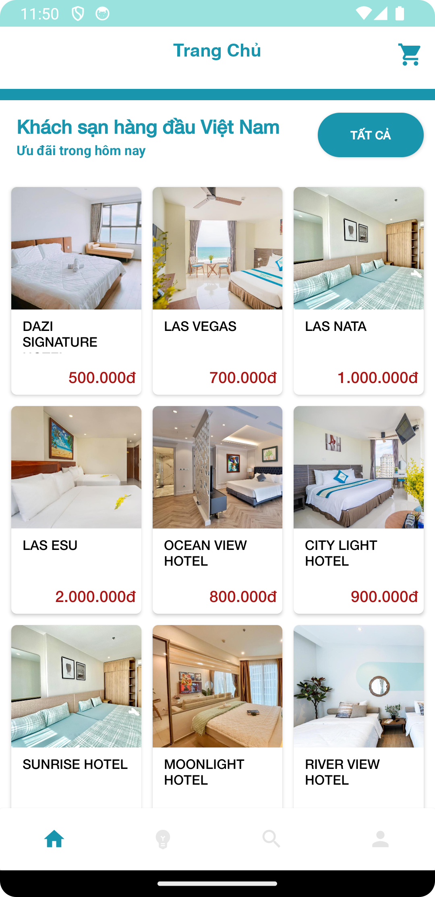
> </a>
<a href="./Image/Home3.png">
>    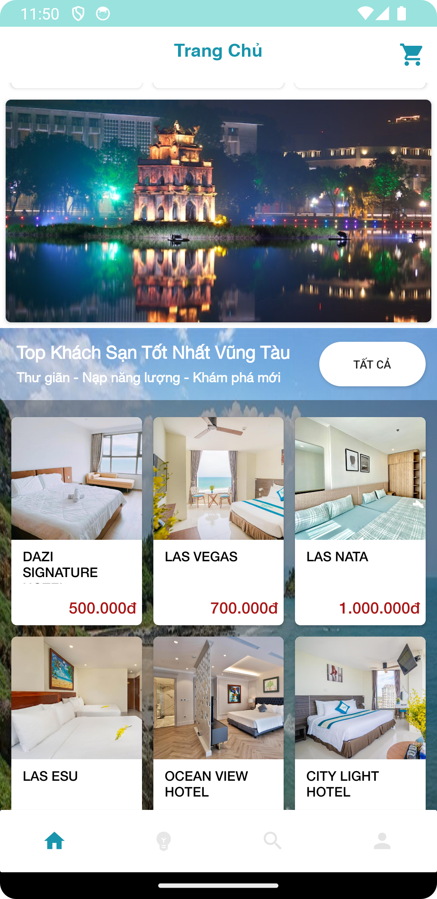
> </a>
<a href="./Image/Home4.png">
>    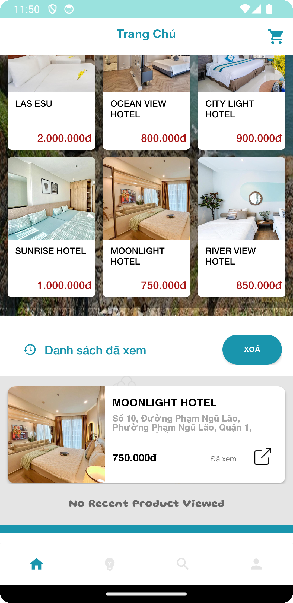
> </a>
<a href="./Image/profile1.png">
>    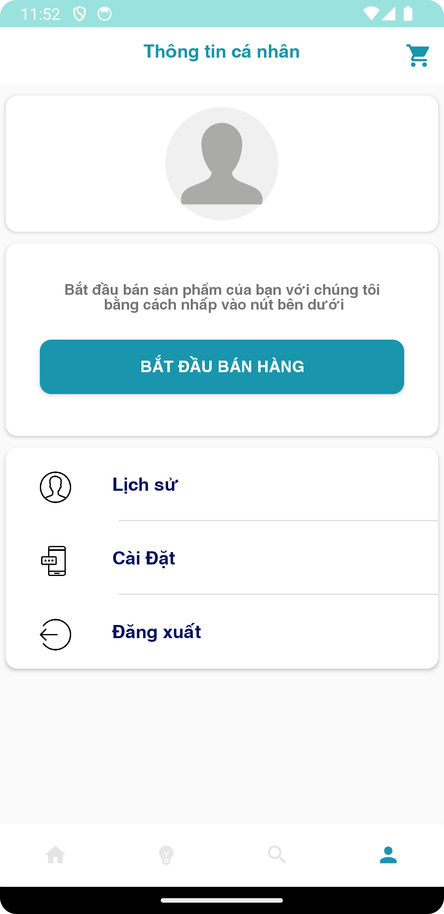
> </a>
<a href="./Image/Search1.png">
>    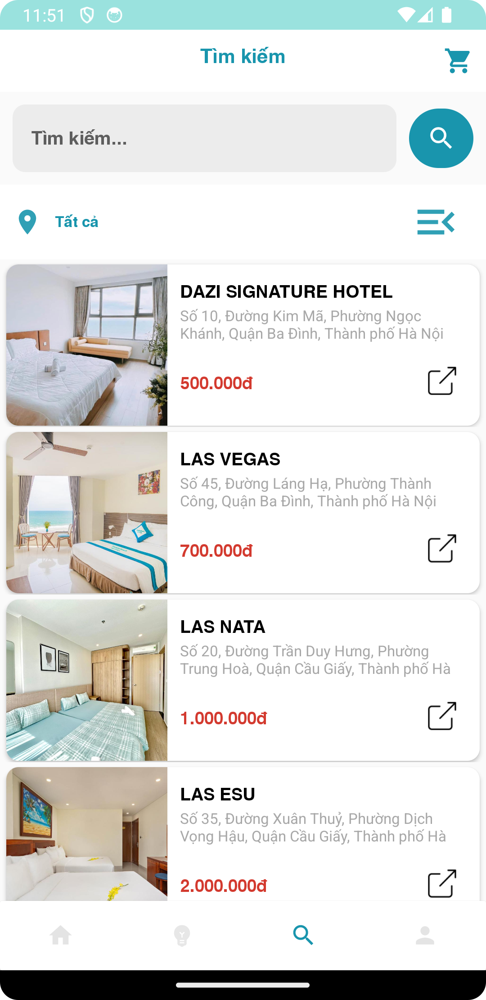
> </a>
<a href="./Image/ThemVoucher_DatPhong.png">
>    
> </a>

